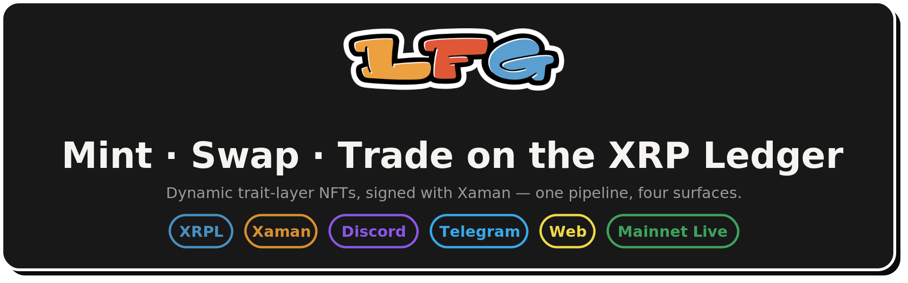
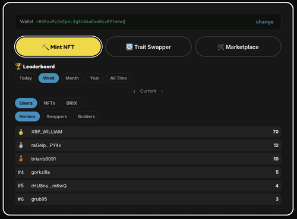
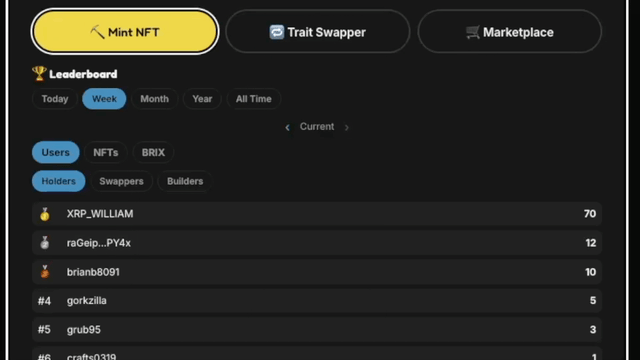
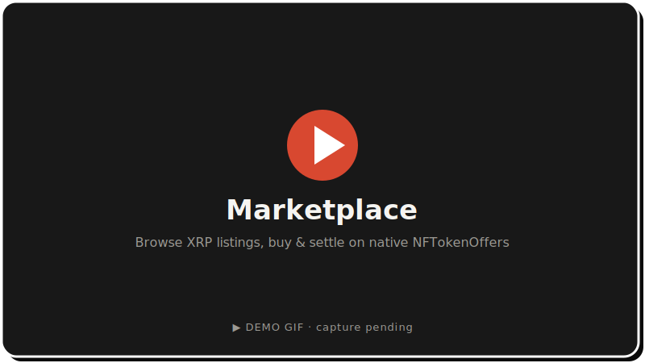
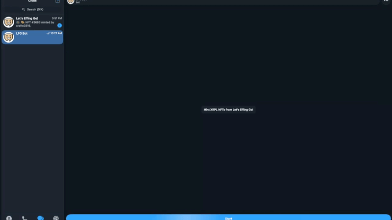
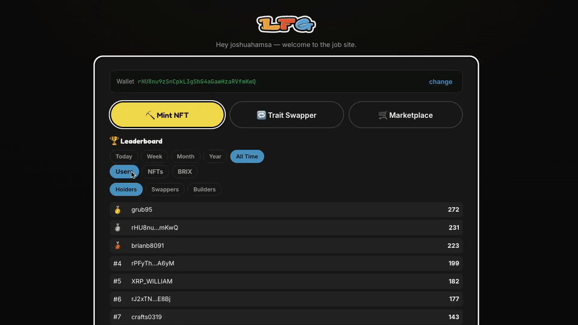
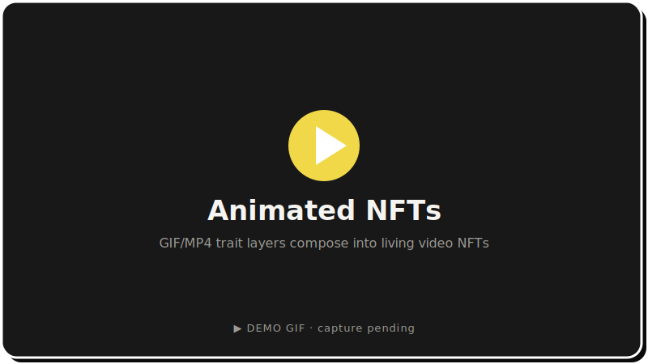
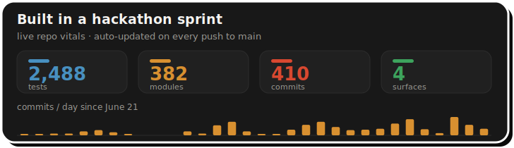
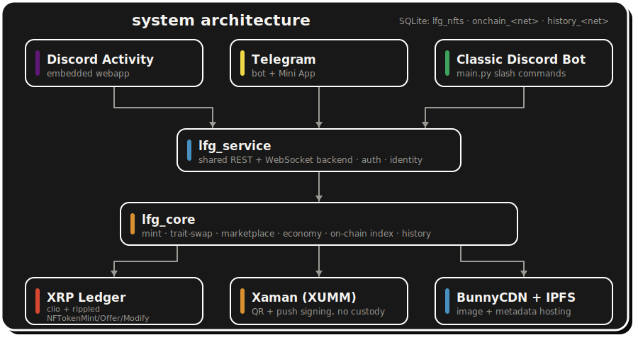

<div align="center">



<br>


<br><br>

**Mint NFTs, swap their traits, and trade them for XRP — signed in Xaman, live on the XRP Ledger, from Discord, Telegram, or the web.**

</div>

---

**LFG** is a multi-surface XRPL app. You mint NFTs whose art is composed on the fly from trait layers, swap individual traits between NFTs you own, and list, browse, and buy them on an in-app marketplace. You pay to mint with the `LFGO` token, cover trait-swap fees in `BRIX` (or its AMM XRP equivalent), trade on the **XRP-denominated** marketplace, and sign every transaction in the [Xaman (XUMM)](https://xaman.app/) wallet — no keys ever touch the app. The same flows run from a Discord bot, a Discord Activity, and a Telegram bot, all backed by one shared service. **The collection is live on XRPL mainnet** — cutover **2026-07-10**, **3,535 editions** reconciled with zero drift.

> **XRPL Make Waves Hackathon** — every XRPL transaction and Xaman signing payload the app builds carries `SourceTag 2606160021`, so all of the volume counts toward this entry.

---

## Live demos

Short walkthroughs of each core flow — animated captures landing soon:

<div align="center">
<table>
<tr>
<td align="center"><br><b>Mint an NFT</b></td>
<td align="center"><br><b>Trait Swapper</b></td>
<td align="center"><br><b>Marketplace</b></td>
</tr>
<tr>
<td align="center"><br><b>Telegram Bot</b></td>
<td align="center"><br><b>Leaderboards</b></td>
<td align="center"><br><b>Animated NFTs</b></td>
</tr>
</table>
</div>

---

## Built in a sprint

<!-- hackathon-loc:start -->


*Hand-written code merged since the hackathon baseline (`e296308`, 2026-06-19 — last commit before June 21, 12,080 lines), measured by `git diff --numstat`. Counts `.py`/`.js`/`.css`/`.html` only; docs, markdown, data files (CSV/JSON manifests), dependency lists, and the legacy/backup trees are excluded. Updated automatically on every push to `main`.*

| Category | Lines added | Lines removed | Net |
|---|---:|---:|---:|
| Application code | +26,174 | −2,643 | 23,531 |
| Tests | +28,331 | −8 | 28,323 |
| **Total** | **+54,505** | **−2,651** | **51,854** |
<!-- hackathon-loc:end -->

<div align="center">

</div>

Both the code-growth bar and the vitals card are regenerated by CI on every push to `main`, so the numbers above are never hand-edited.

**→ [Full hackathon build log](docs/HACKATHON.md)** — every feature, with the PRs and issues that landed it.

---

## Highlights

<table>
<tr>
<td>🎨 <b>Dynamic NFT art</b><br>Traits selected per rules, composited with ffmpeg across 5 body types.</td>
<td>🔀 <b>Trait Swapper</b><br>Exchange traits between two NFTs in place via <code>NFTokenModify</code>.</td>
</tr>
<tr>
<td>🛒 <b>In-app Marketplace</b><br>XRP listings on native <code>NFTokenOffer</code>s — no escrow, no custody.</td>
<td>📲 <b>Xaman push delivery</b><br>Sign requests pushed straight to the app, with QR fallback.</td>
</tr>
<tr>
<td>🌐 <b>Three surfaces, one backend</b><br>Discord bot, Telegram bot, and Discord Activity on <code>lfg_service</code>.</td>
<td>🏆 <b>8 leaderboards</b><br>Holders, swaps, builds, BRIX richlist, LP, rarity — with time windows.</td>
</tr>
<tr>
<td>🎞 <b>Animated NFTs</b><br>GIF/MP4 trait layers compose into video NFTs with a PNG thumbnail.</td>
<td>🧬 <b>Declarative trait rules</b><br><code>trait_config.yaml</code> drives z-order, body affinity, and the swap matrix.</td>
</tr>
<tr>
<td>🔗 <b>On-chain index + history DB</b><br>Clio listeners keep per-network SQLite index and ledger-history stores fresh.</td>
<td>🔐 <b>No custody</b><br>No private keys in the app — every transaction is signed in the user's Xaman wallet.</td>
</tr>
</table>

<details>
<summary><b>All features</b></summary>

| Feature | Status |
|---|---|
| Dynamic NFT generation (trait selection + ffmpeg compositing) | ✅ |
| Animated NFT support (`.gif`/`.mp4` layers → video NFT + PNG thumbnail) | ✅ |
| Unified CDN/local trait layer store | ✅ |
| Xaman QR signing (payment, trustline, offer acceptance) | ✅ |
| Trait Swapper — in-place swap via `NFTokenModify` (mutable NFTs) | ✅ |
| Replay-safe payment watching over XRPL websocket | ✅ |
| BunnyCDN image + metadata hosting | ✅ |
| Discord Activity (embedded webapp) | ✅ |
| Variable rarity engine (mainnet-seeded weights, network-scoped) | ✅ |
| BRIX trustline setup button | ✅ |
| Admin panel (stats, NFT lookup, burn with audit log) | ✅ |
| Shared-services spine — one `lfg_service` backend, thin surface clients | ✅ |
| Telegram surface (bot + trait swapper + Mini App) | ✅ |
| Dress-up trait economy (Closet, harvest/assemble/equip, tradeable trait tokens) | ⏸ built, disabled in production — see note below |
| In-app NFT marketplace (list / browse / buy via Xaman, XRP-denominated) | ✅ |
| Xaman push delivery (sign requests pushed to the app, QR fallback) | ✅ |
| Ledger history database + Activity leaderboards (incl. BRIX richlist) | ✅ |
| On-chain NFT index with live listeners | ✅ |
| Seasonal trait manifest (Season 3 mint exclusion) | ✅ |
| Mainnet launch hardening (regular-key signing, feature flags, live BRIX/XRP AMM) | ✅ |
| Declarative trait rules engine (`trait_config.yaml`: z-order, body affinity, validation CLI) | ✅ |
| Body-affinity matrix derived from full mint history (3,535 editions audited) | ✅ |
| Cross-body trait swapping (compatibility matrix, API-enforced + UI-filtered) | ✅ |
| Shared trait layers (`layers/shared/` with verify-then-move migration) | ✅ |
| Fifth body type (milady) live in the mint pool | ✅ |
| Animated trait layers (transparent GIF bodies → video NFTs, gifski pipeline) | ✅ |
| Mainnet launch — live collection, network-aware databases, post-cutover hardening | ✅ |

</details>

---

## Trait economy status

> **The dress-up trait economy is built but switched off in production.** All four phases — the soulbound **Closet**, **Harvest / Assemble / Equip** on-ledger ops, and **tradeable trait tokens** (Extract / Deposit) — are implemented and ran on testnet. It is currently gated off in production (`ECONOMY_ENABLED=0`) while a batch of review findings ([#178](../../issues/178)–[#184](../../issues/184)) are worked through. Re-enable is tracked in **[#185](../../issues/185)**.

---

## Architecture

<div align="center">

</div>

Three thin surfaces — the classic **Discord bot**, the **Telegram bot**, and the **Discord Activity** webapp — all talk over REST/WS to one aiohttp backend (`lfg_service`), which runs the mint / swap / market / economy session state machines, submits every XRPL transaction, and builds every Xaman signing payload. Shared domain logic lives in `lfg_core`; a **separate listener process group** streams the clio transaction feed into the per-network SQLite index and ledger-history stores that the backend reads. **No private keys ever touch the app** — all signing happens in the user's Xaman wallet, images and metadata are hosted on BunnyCDN, and the NFT schema is pinned on IPFS.

<details>
<summary><b>Repository layout</b></summary>

```
LFG/
├── main.py                 # Classic Discord bot launch shim
├── run_telegram.py         # Telegram surface launch shim
├── lfg_service/            # Shared REST/WS backend (aiohttp) — the hub
│   └── app.py              # API, Activity static host, session state machines
├── lfg_core/               # Shared domain library (used by every process)
│   ├── config.py           # All environment configuration
│   ├── xrpl_ops.py         # Mint, burn, offers, payment watching
│   ├── xumm_ops.py         # Xaman payload builders + SourceTag/Memos
│   ├── mint_flow.py        # Mint session state machine
│   ├── swap_flow.py        # Trait-swap state machine
│   ├── market_flow.py      # Marketplace list/buy/cancel state machines
│   ├── economy_flow.py     # Dress-up economy flows
│   ├── layer_store.py      # Trait layer store (local-first)
│   └── traits.py           # Rules-driven trait selection
├── surfaces/
│   ├── discord_bot/        # Discord bot (bot.py, commands, views, admin)
│   ├── telegram_bot/       # Telegram bot + Mini App
│   └── _client/, _shared/  # Surface SDK (LFGServiceClient) + plumbing
├── webapp/
│   ├── server.py           # 8-line launch shim → lfg_service.app
│   └── client/             # No-build Activity frontend (vanilla JS)
├── scripts/                # Ops: onchain_listener, backfills, audits, economy CLIs
├── trait_config.yaml       # Declarative trait rules (z-order, affinity, swap matrix)
└── docs/                   # ACTIVITY_SETUP.md, HACKATHON.md
```

</details>

---

## Quick start

**Prerequisites:** Python 3.10+, `ffmpeg` on the system path, a Discord application (bot token + Client ID/Secret), [Xaman API credentials](https://apps.xumm.dev/), a BunnyCDN storage zone, and a funded XRPL account ([testnet faucet](https://xrpl.org/xrp-testnet-faucet.html) for testing).

```bash
git clone https://github.com/Team-Hamsa/LFG.git
cd LFG
sudo apt-get update && sudo apt-get install -y ffmpeg
./setup.sh   # builds .venv, installs deps, installs the pre-push hook
```

Then create a `.env` in the repo root and run a surface:

```bash
# Discord Activity backend (the hub — port 8176)
python -m lfg_service.app

# Classic Discord bot
python main.py

# Telegram bot
python run_telegram.py

# Tests
python3 -m pytest
```

<details>
<summary><b>Environment variables</b></summary>

Minimum to mint from the classic bot:

```plaintext
DISCORD_BOT_TOKEN=...        # classic bot only
XUMM_API_KEY=...
XUMM_API_SECRET=...
SEED=...                     # XRPL wallet seed used for minting/backend signing
TOKEN_ISSUER_ADDRESS=...
TOKEN_CURRENCY_HEX=...
BUNNY_CDN_ACCESS_KEY=...
BUNNY_CDN_STORAGE_ZONE=...
```

The Discord Activity additionally needs:

```plaintext
DISCORD_CLIENT_ID=...
DISCORD_CLIENT_SECRET=...
WEBAPP_SESSION_SECRET=...
WEBAPP_PORT=8176
```

Optional surfaces / features: `TELEGRAM_BOT_TOKEN`, `SERVICE_TOKEN_TELEGRAM`,
`TELEGRAM_MINI_APP_URL` (Mini App), `ECONOMY_ENABLED` (trait economy, `0` in
production), `XRPL_NETWORK`, `XRPL_CLIO_WS_URL`, `BRIX_DISTRIBUTOR_ADDRESS`,
`BRIX_AMM_ACCOUNT`.

The full list with defaults lives in `lfg_core/config.py`. **Defaults target
mainnet** (`XRPL_NETWORK=mainnet`, `s1.ripple.com`); set `XRPL_NETWORK=testnet`
for testing. Full Discord Activity setup is documented in
[docs/ACTIVITY_SETUP.md](docs/ACTIVITY_SETUP.md).

</details>

<details>
<summary><b>Trait layers</b></summary>

Trait art is served from the local `layers/` tree (`LAYER_SOURCE=local`, the
production setting); BunnyCDN is still used for minted image/metadata uploads.

```
layers/
├── shared/     # universal art every body pulls from (Background, Back)
├── male/  female/  ape/  milady/  skeleton/
│   └── Body/ Clothing/ Mouth/ Eyebrows/ Eyes/ Head/ Accessory/
```

Trait legality — layer order, per-value body affinity, and the cross-body swap
matrix — lives in `trait_config.yaml` at the repo root, validated by
`scripts/validate_trait_config.py` (runs in pre-commit and CI).

</details>

---

## Roadmap

**Remaining**

- [ ] [#42 — standalone browser web UI (mint + collection viewer)](../../issues/42)
- [ ] [#41 — X (Twitter) integration (OAuth2, auto-post on mint)](../../issues/41)
- [ ] **Trait economy re-enable** — clear review findings [#178](../../issues/178)–[#184](../../issues/184), go-live checklist [#185](../../issues/185)
- [ ] [#45 — DEX integration backend (OfferCreate/Cancel, order book)](../../issues/45)
- [ ] [#47 — AMM integration backend (deposit/withdraw/swap, pool stats)](../../issues/47)
- [ ] [#48 — BRIX daily distribution (1/day per unlisted NFT, claim flow)](../../issues/48)
- [ ] [#39 — Admin UI for authoring `trait_config.yaml`](../../issues/39)

<details>
<summary><b>Completed</b></summary>

- [x] [#26 — Testnet BRIX/XRP AMM pool](../../issues/26)
- [x] [#27 — QR callback routing for mobile (UA-aware deep-link)](../../issues/27)
- [x] [#28 — Generation rules and exclusions (body-affinity matrix from mint history)](../../issues/28)
- [x] [#29 — NFT rarity logic (tiers, weights, metadata scoring)](../../issues/29)
- [x] [#30 — Cross-body-type trait swapping rules](../../issues/30)
- [x] [#38 — Ape bodies incorrectly assigned face traits](../../issues/38)
- [x] [#40 — Trait selection rules engine (`trait_config.yaml`)](../../issues/40)
- [x] [#43 — Telegram integration](../../issues/43)
- [x] [#44 — In-app marketplace (list, browse, buy via Xaman)](../../issues/44)
- [x] [#46 — Dress-up game](../../issues/46) — built; disabled in production pending [#185](../../issues/185)
- [x] [#49 — AI agent integration via XRPL Payments skill (exploration)](../../issues/49)
- [x] Shared-services spine — one backend + Surface SDK ([#43](../../issues/43)/[#53](../../issues/53); PRs [#76](../../pull/76), [#78](../../pull/78), [#79](../../pull/79), [#80](../../pull/80), [#81](../../pull/81), [#82](../../pull/82))
- [x] Milady body + animated trait layers (PRs [#171](../../pull/171), [#174](../../pull/174))
- [x] Network-aware app database — testnet mints no longer poison the mainnet counter (PR [#167](../../pull/167))
- [x] Mainnet cutover — 3,535 live editions, zero drift (2026-07-10)

</details>

---

## License

LFG is released under the **MIT License** — see [LICENSE](LICENSE).

---

<div align="center">

**[Build log](docs/HACKATHON.md)** · **[Activity setup](docs/ACTIVITY_SETUP.md)** · **[Contributing](CONTRIBUTING.md)** · **[License](#license)**

</div>

**Acknowledgments** — [xrpl-py](https://github.com/XRPLF/xrpl-py), the [Xaman (XUMM) SDK](https://github.com/XRPL-Labs/XUMM-SDK), the [Discord Embedded App SDK](https://github.com/discord/embedded-app-sdk), [BunnyCDN](https://bunny.net/), and [FFmpeg](https://ffmpeg.org/).

*XRPL Make Waves Hackathon — every XRPL tx carries `SourceTag 2606160021`.*
