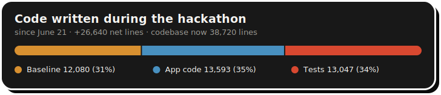

# LFG — XRPL NFT Minting Bot & Discord Activity

  -Integration-orange)

**LFG** lets users mint NFTs on the XRP Ledger (XRPL) and swap traits between NFTs they own, paying with the `LFGO` token via the Xaman (XUMM) app. NFT images are composed dynamically from trait layers with ffmpeg, uploaded to BunnyCDN, and minted on the XRPL.

Three front ends share one backend (`lfg_service`) and one pipeline (`lfg_core/`):

- **Discord Activity webapp** (`python -m lfg_service.app`) — embedded app running inside Discord: wallet registration, LFGO trustline setup, NFT minting, the Trait Swapper, the Dressing Room, and Leaderboards. Setup: [docs/ACTIVITY_SETUP.md](docs/ACTIVITY_SETUP.md).
- **Telegram bot** (`python run_telegram.py`) — chat-style mint + trait swapper via inline keyboards, plus a feature-flagged Mini App that serves the same Activity inside Telegram.
- **Classic Discord bot** (`python main.py`) — slash-command/button interface for the same mint flow.

All surfaces run side by side against the shared `lfg_service` backend.

> **XRPL Make Waves Hackathon:** every XRPL transaction and Xaman signing payload the app builds carries `SourceTag 2606160021`.

---

## What's Built

| Feature | Status |
|---|---|
| Dynamic NFT generation (trait selection + ffmpeg compositing) | ✅ |
| Animated NFT support (`.gif`/`.mp4` layers → video NFT + PNG thumbnail) | ✅ |
| Unified CDN/local trait layer store | ✅ |
| Xaman QR signing (payment, trustline, offer acceptance) | ✅ |
| Trait Swapper — in-place swap via `NFTokenModify` (mutable NFTs) | ✅ |
| Replay-safe payment watching over XRPL websocket | ✅ |
| BunnyCDN image + metadata hosting | ✅ |
| Discord Activity (embedded webapp) | ✅ |
| Variable rarity engine (mainnet-seeded weights, network-scoped) | ✅ |
| BRIX trustline setup button | ✅ |
| Admin panel (stats, NFT lookup, burn with audit log) | ✅ |
| Shared-services spine — one `lfg_service` backend, thin surface clients | ✅ |
| Telegram surface (bot + trait swapper + Mini App) | ✅ |
| Dress-up trait economy (Closet, harvest/assemble/equip, tradeable trait tokens) | ✅ |
| Ledger history database + Activity leaderboards (incl. BRIX richlist) | ✅ |
| On-chain NFT index with live listeners | ✅ |
| Seasonal trait manifest (Season 3 mint exclusion) | ✅ |
| Mainnet launch hardening (regular-key signing, feature flags, live BRIX/XRP AMM) | ✅ |

---

## Shipped During the Hackathon (since June 21)

Everything below was designed, built, and merged during the Make Waves sprint. PR numbers link the work.

### Lines of Code

<!-- hackathon-loc:start -->


*Hand-written code merged since the hackathon baseline (`e296308`, 2026-06-19 — last commit before June 21, 12,080 lines), measured by `git diff --numstat`. Counts `.py`/`.js`/`.css`/`.html` only; docs, markdown, data files (CSV/JSON manifests), dependency lists, and the legacy/backup trees are excluded. Updated automatically on every push to `main`.*

| Category | Lines added | Lines removed | Net |
|---|---:|---:|---:|
| Application code | +15,942 | −2,434 | 13,508 |
| Tests | +13,048 | −1 | 13,047 |
| **Total** | **+28,990** | **−2,435** | **26,555** |
<!-- hackathon-loc:end -->

### Shared-Services Spine ([#43](../../issues/43) / [#53](../../issues/53)) — #76, #78–#81
One `lfg_service` backend now serves every surface through a shared Surface SDK: the REST/WS backend (Plan 1), the `LFGServiceClient` SDK (Plan 2), the Discord bot migration (Plan 3), and the new Telegram surface (Plan 4).

### Telegram Integration — #81–#83, #92–#98
- Full Telegram bot: registration, minting, and a chat-style **trait swapper via inline keyboards** (#96).
- **Telegram Mini App** (feature-flagged) serving the Activity inside Telegram with signed-`initData` auth (#98).
- Xaman-verified `/register` on both Discord and Telegram (#83).
- Unified wallet-keyed **cross-surface accounts** with display handles (#94), minted-artwork announcements (#92, #95), and a cross-surface event **firehose** announcing swaps and economy actions everywhere (#97).

### Dress-up Trait Economy ([#46](../../issues/46)) — #62, #67, #71, #105, #106
A full on-ledger trait economy in four phases:
- **Phase 1** — supply model, genesis reconciliation, conservation auditor (#62).
- **Phase 2** — on-ledger ops: **Harvest** (burn a character → its traits drop into your Closet), **Assemble** (body + full trait set → re-mint), **Equip** (`NFTokenModify` a loose trait onto a live character) (#67).
- **Phase 3** — **Dressing Room UI** in the Discord Activity: visual composer with canvas + roster (#71).
- **Phase 4** — **tradeable trait tokens**: Extract a Closet trait as a standalone transferable NFToken (70% royalty) and Deposit it back, creating a secondary market for individual traits (#106).
- The per-user **Closet** is a soulbound mutable NFToken with standalone issuance (#105).

### Ledger History + Leaderboards (not in original scope) — #118–#121
- Per-network **ledger history database**: raw `account_tx` archive with derived NFT and BRIX events, resumable backfill (95k+ mainnet txs), and live dual-write from the index listeners (#118, #119).
- Public `GET /api/leaderboard` with **8 boards** — most NFTs held, most swaps, most builds, most-swapped NFTs, **BRIX richlist**, LP richlist, BRIX earned, and NFT rarity — with rolling time windows and a "me" rank lookup.
- Activity **Leaderboard UI** with a two-tier category/board selector (#120, #121).
- Nightly BRIX/LP balance snapshots for trend charts.

### On-chain NFT Index (not in original scope) — #59, #60
Per-network SQLite index of every live NFToken (the chain holds multiple tokens per edition), kept fresh by pm2 listeners on the clio tx stream, plus a layer-coverage auditor and Bithomp CSV importer.

### NFT Generation & Rules
- **Ape face compose rule** — nose injection + melt-ape masking, fixing face traits on ape bodies ([#38](../../issues/38)) (#110).
- **Seasonal trait manifest** — sidecar `layers/seasons.json` (1,167 traits across 3 seasons) with Season 3 excluded from minting (#115–#117).

### Mainnet Launch Hardening
- Regular-key signing for the issuer (`SIGNING_ACCOUNT` override) (#112).
- `ECONOMY_ENABLED` flag to launch with the trait economy off (#113).
- Bithomp import filtered by collection issuer; census reconciled to 3,535 clean editions (#111).
- **Mainnet BRIX/XRP AMM pool live** and quoting for the trait-swap fee path; testnet pool tooling (`scripts/testnet_amm_setup.py`) closes [#26](../../issues/26).

---

## Roadmap — Remaining

- [ ] [#40 Trait selection rules engine (declarative `trait_config.yaml`)](../../issues/40)
- [ ] [#28 Port generation rules and exclusions from legacy scripts](../../issues/28)
- [ ] [#30 Cross-body-type trait layer swapping rules](../../issues/30)
- [ ] [#42 Web UI (standalone browser-based mint + collection viewer)](../../issues/42)
- [ ] [#41 X (Twitter) integration (OAuth2, auto-post on mint)](../../issues/41)
- [ ] [#44 In-app collection Marketplace (list, browse, buy via Xaman)](../../issues/44)
- [ ] [#45 DEX integration — backend (OfferCreate/Cancel, order book)](../../issues/45)
- [ ] [#47 AMM integration — backend (deposit/withdraw/swap, pool stats)](../../issues/47)
- [ ] [#48 BRIX daily distribution (1/day per unlisted NFT, claim flow)](../../issues/48) — leaderboard/history groundwork shipped in #118
- [ ] [#39 Admin UI for authoring `trait_config.yaml`](../../issues/39)
- [ ] [#27 QR callback routing for mobile (UA-aware deep-link)](../../issues/27)

### Completed
- [x] [#26 Testnet BRIX/XRP AMM pool](../../issues/26)
- [x] [#29 NFT rarity logic (tiers, weights, metadata scoring)](../../issues/29)
- [x] [#38 Ape bodies incorrectly assigned face traits](../../issues/38)
- [x] [#43 Telegram integration](../../issues/43)
- [x] [#46 Dress-up game](../../issues/46)
- [x] [#49 Explore: AI agent integration via XRPL Payments skill](../../issues/49)

---

## Repository Layout

```
LFG/
├── main.py                  # Classic Discord bot entry point
├── lfg_core/                # Shared pipeline (used by both front ends)
│   ├── config.py            # All environment configuration
│   ├── xrpl_ops.py          # Mint, burn, offers, payment watching
│   ├── xumm_ops.py          # Xaman payloads + QR generation
│   ├── mint_flow.py         # Mint session state machine
│   ├── swap_flow.py         # Trait-swap state machine (modify-in-place / mint-before-burn)
│   ├── swap_meta.py         # Wallet NFT + metadata fetching
│   ├── swap_compose.py      # ffmpeg compositing + output upload
│   ├── layer_store.py       # Unified CDN/local trait layer store
│   ├── traits.py            # Random trait selection
│   └── cdn.py               # BunnyCDN upload helper
├── webapp/
│   ├── server.py            # aiohttp backend for the Discord Activity
│   ├── client/              # No-build frontend (index.html, app.js, style.css)
│   └── test_smoke.py        # Smoke tests
├── lfg_service/             # Shared REST/WS backend serving all surfaces
├── surfaces/telegram_bot/   # Telegram surface (bot + Mini App)
├── run_telegram.py          # Telegram launch shim
├── db_helpers.py            # LFG (mint records) table helpers
├── user_db.py               # Users table (wallet registration)
├── init_db.py               # Database initialization
├── scripts/                 # Ops tooling: backfills, listeners, audits, economy CLIs
└── docs/ACTIVITY_SETUP.md   # Discord Activity setup guide
```

---

## Prerequisites

- Python 3.10+
- `ffmpeg` on the system path
- Discord application — bot token + Client ID/Secret. Privileged gateway intents required (classic bot); Activities enabled (webapp). Full steps in [docs/ACTIVITY_SETUP.md](docs/ACTIVITY_SETUP.md).
- [Xaman (XUMM) API credentials](https://apps.xumm.dev/)
- BunnyCDN storage zone credentials
- Funded XRPL account ([testnet faucet](https://xrpl.org/xrp-testnet-faucet.html) for testing)

---

## Installation

```bash
git clone https://github.com/Team-Hamsa/LFG.git
cd LFG
sudo apt-get update && sudo apt-get install -y ffmpeg
pip install -r requirements.txt
```

### Environment Variables

Create a `.env` in the repo root:

```plaintext
DISCORD_BOT_TOKEN=...        # classic bot only
XUMM_API_KEY=...
XUMM_API_SECRET=...
SEED=...                     # XRPL wallet seed used for minting
TOKEN_ISSUER_ADDRESS=...
TOKEN_CURRENCY_HEX=...
BUNNY_CDN_ACCESS_KEY=...
BUNNY_CDN_STORAGE_ZONE=...
```

Discord Activity additionally needs:

```plaintext
DISCORD_CLIENT_ID=...
DISCORD_CLIENT_SECRET=...
WEBAPP_SESSION_SECRET=...
WEBAPP_PORT=8080
```

Full list with defaults in `lfg_core/config.py`. Defaults point at **testnet**; set `XRPL_JSON_RPC_URL` / `XRPL_WS_URL` for mainnet.

### Trait Layers

Upload layers to BunnyCDN or set `LAYER_SOURCE=local` for development:

```
layers/
├── male/
│   ├── Background/<Value>.png|.gif|.mp4
│   ├── Back/ Body/ Clothing/ Mouth/ Eyebrows/ Eyes/ Head/ Accessory/
├── female/
├── ape/
└── skeleton/
```

Use `scripts/upload_layers_cdn.py` to push a local `layers/` tree.

---

## Running

```bash
# Discord Activity
python -m lfg_service.app

# Classic bot
python main.py

# Tests
python3 -m pytest webapp/test_smoke.py
```

---

## Usage

1. Launch the Activity from a voice channel or App Launcher (or run `/letsgo` in the classic bot).
2. Register your XRPL wallet (first time only).
3. Optionally set the LFGO trustline via QR / Xaman deep link.
4. **Mint** — pay 1 LFGO, accept the NFT offer in Xaman.
5. **Trait Swapper** — pick two of your NFTs, choose traits to exchange, confirm; pay BRIX and accept via Xaman QR.

---

## Contributing

1. Fork the repo.
2. Create a branch (`git checkout -b feature/your-feature`).
3. Commit and push.
4. Open a pull request.

---

## License

MIT — see [LICENSE](LICENSE).

---

## Acknowledgments

- [xrpl-py](https://github.com/XRPLF/xrpl-py)
- [Xaman (XUMM) SDK](https://github.com/XRPL-Labs/XUMM-SDK)
- [Discord Embedded App SDK](https://github.com/discord/embedded-app-sdk)
- [BunnyCDN](https://bunny.net/)
- [FFmpeg](https://ffmpeg.org/)
