<div align="center">

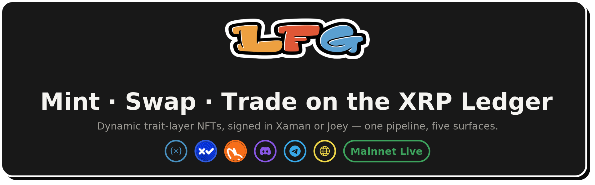

<br>

<!-- badges:start -->

<a href="https://build.letseffinggo.com"></a>


<a href="https://github.com/Team-Hamsa/LFG/actions/workflows/ci.yml"></a>


<!-- badges:end -->

<br><br>

**Mint NFTs, swap their traits, and trade them for XRP — signed in Xaman, live on the XRP Ledger, from Discord, Telegram, or the web.**

**🌐 Try it right now in your browser → [build.letseffinggo.com](https://build.letseffinggo.com)**

</div>

---

**LFG is an XRPL NFT platform where the art is composed at mint time from trait layers — and the traits themselves are tradeable on-ledger assets.**

You mint NFTs — one at a time, or many behind a single payment — swap individual traits between NFTs you own, and list, browse, and buy on an in-app marketplace. Two project-issued tokens drive the economy: **LFGO** pays for mints, and **BRIX** pays trait-swap fees and prices trait listings (with an XRP→BRIX AMM on-ramp for buyers who hold neither). Characters trade in XRP; traits trade in BRIX.

Every transaction is signed by the user in the [Xaman](https://xaman.app/) wallet (formerly XUMM) — **no private keys ever touch the app** — and carries on-chain **provenance memos** recording who signed, from which surface, and what action it was. The same flows run from four client surfaces on one shared backend: a Discord bot, a Discord Activity, a Telegram bot, and a standalone web app at [build.letseffinggo.com](https://build.letseffinggo.com). The web app is an **installable PWA** that runs anywhere a browser does — including X's own in-app browser, so a mint can start from a timeline via each NFT's **Share on X** card page.

**The collection is live on XRPL mainnet** — cut over **2026-07-10** (3,535 editions — minted NFTs — reconciled with zero drift) and grown to **~4,000 live editions** since.

> **XRPL Make Waves Hackathon** — every XRPL transaction and Xaman signing payload the app builds carries `SourceTag 2606160021` (an XRPL field identifying the submitting application), so all of the volume counts toward this entry.

---

## Live demos

Short walkthroughs of each core flow:

<div align="center">
<table>
<tr>
<td align="center">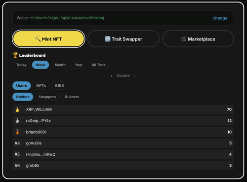<br><b>Mint an NFT</b></td>
<td align="center">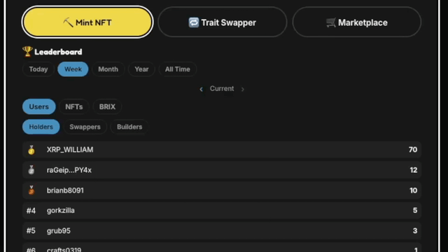<br><b>Trait Swapper</b></td>
</tr>
<tr>
<td align="center">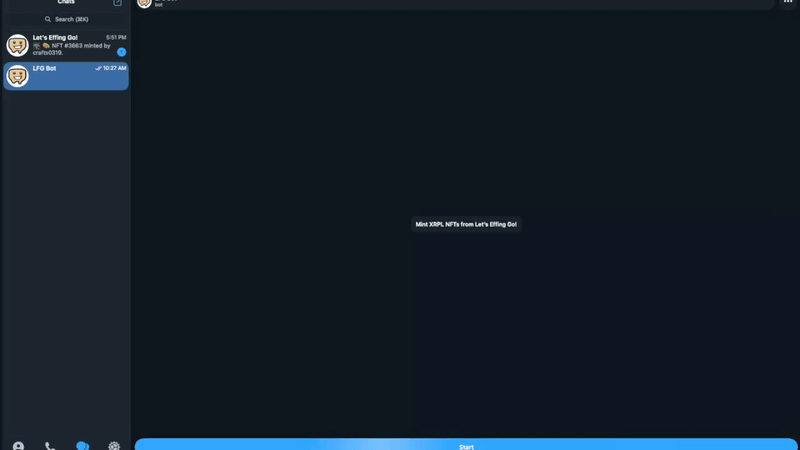<br><b>Telegram Bot</b></td>
<td align="center">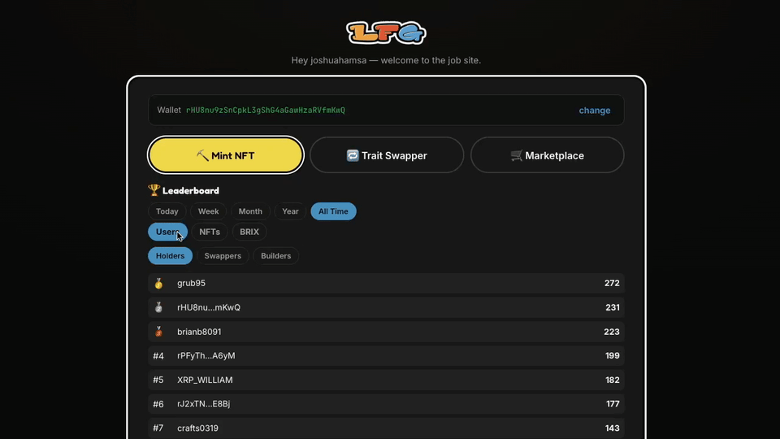<br><b>Leaderboards</b></td>
</tr>
<tr>
<td align="center"><br><b>Animated NFTs</b></td>
<td align="center">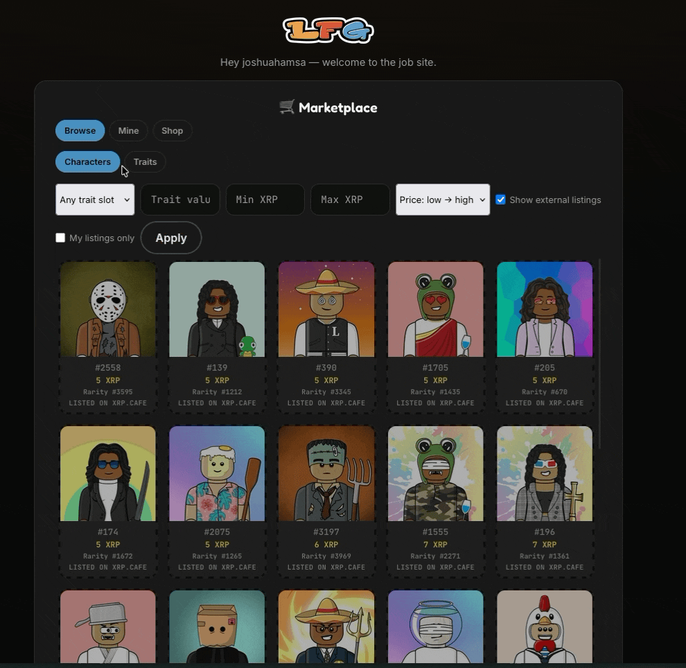<br><b>Marketplace</b></td>
</tr>
</table>
</div>

---

## Built in a sprint

<!-- hackathon-loc:start -->
<div align="center">
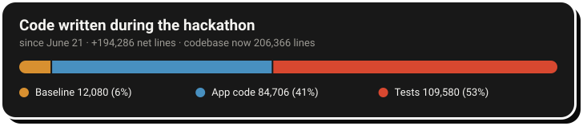
</div>

> **Baseline: Code written before the June 21 Make Waves hackathon began** measured from `e296308` (2026-06-19, 12,080 lines) by `git diff --numstat` over `.py`/`.js`/`.css`/`.html`, excluding docs, data files (CSV/JSON manifests), dependency lists, and the legacy/backup trees. Regenerated on every push to `main`.
<!-- hackathon-loc:end -->

<div align="center">
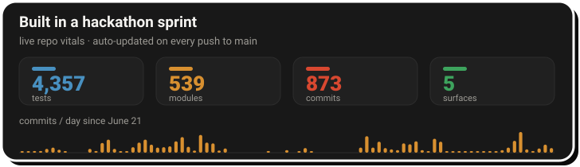
</div>

<div align="center">
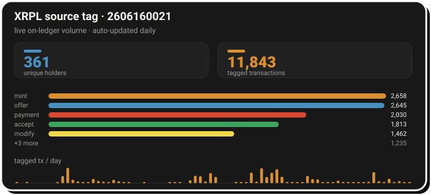
</div>

**→ [Full hackathon build log](docs/HACKATHON.md)** — every feature, with the PRs and issues that landed it.

---

## Highlights

<table>
<tr>
<td>🎨 <b>Dynamic NFT art</b><br>Traits selected per rules, composited with ffmpeg across 5 body types.</td>
<td>🔀 <b>Trait Swapper</b><br>Exchange traits between two NFTs in place via <code>NFTokenModify</code>.</td>
</tr>
<tr>
<td>🛒 <b>In-app Marketplace</b><br>Characters in XRP, traits in BRIX, on native <code>NFTokenOffer</code>s — no escrow, no custody.</td>
<td>📲 <b>Xaman push delivery</b><br>Sign requests pushed straight to the app, with QR fallback.</td>
</tr>
<tr>
<td>🌐 <b>Four surfaces, one backend</b><br>Discord bot, Telegram bot, Discord Activity, and <a href="https://build.letseffinggo.com">the web app</a> on <code>lfg_service</code>.</td>
<td>🏆 <b>8 leaderboards</b><br>Holders, swaps, builds, per-NFT swap counts, BRIX richlist, LP, BRIX earned, rarity — with time windows.</td>
</tr>
<tr>
<td>🎞 <b>Animated NFTs</b><br>GIF/MP4 trait layers compose into video NFTs with a PNG thumbnail.</td>
<td>🧬 <b>Declarative trait rules</b><br><code>trait_config.yaml</code> drives z-order, body affinity, and the swap matrix.</td>
</tr>
<tr>
<td>🔗 <b>On-chain index + history DB</b><br><a href="https://github.com/XRPLF/clio">Clio</a> (XRPL history server) listeners keep per-network SQLite index and ledger-history stores fresh.</td>
<td>🔐 <b>No custody</b><br>No private keys in the app — every transaction is signed in the user's Xaman wallet.</td>
</tr>
<tr>
<td>🧾 <b>On-chain provenance</b><br>Every tx carries <code>SourceTag</code> + Memos — who signed, which surface, what action.</td>
<td>📦 <b>Bulk minting</b><br>Pay once, mint N editions in one durable, crash-resumable batch job.</td>
</tr>
<tr>
<td>📣 <b>Share on X</b><br>Per-NFT card pages render branded Twitter cards; humans are forwarded into the app, with share attribution.</td>
<td>📱 <b>Installable PWA</b><br>Web manifest + homescreen icons — the app runs (and mints) even inside X's in-app browser.</td>
</tr>
</table>

<details>
<summary><b>All features</b></summary>

| Feature | Status |
|---|---|
| Dynamic NFT generation (trait selection + ffmpeg compositing) | ✅ |
| Animated NFT support (`.gif`/`.mp4` layers → video NFT + PNG thumbnail) | ✅ |
| Unified CDN/local trait layer store | ✅ |
| Xaman QR signing (payment, trustline, offer acceptance) | ✅ |
| Trait Swapper — in-place swap via `NFTokenModify` (mutable NFTs) | ✅ |
| Replay-safe payment watching over XRPL websocket | ✅ |
| BunnyCDN image + metadata hosting | ✅ |
| Discord Activity (embedded webapp) | ✅ |
| Standalone web app — the same Activity in any browser at [build.letseffinggo.com](https://build.letseffinggo.com) (GitHub Pages front-end + wallet sign-in) | ✅ |
| Installable PWA (web manifest, homescreen + maskable icons, social share card) — mints from X's in-app browser | ✅ |
| Variable rarity engine (mainnet-seeded weights, network-scoped) | ✅ |
| BRIX trustline setup button | ✅ |
| Admin panel (stats, NFT lookup, burn with audit log) | ✅ |
| Shared-services spine — one `lfg_service` backend, thin surface clients | ✅ |
| Telegram surface (bot + trait swapper + Mini App) | ✅ |
| Dress-up trait economy (Closet, harvest/assemble/equip, tradeable trait tokens) | ✅ live on mainnet |
| In-app NFT marketplace (list / browse / buy via Xaman; characters in XRP, traits in BRIX with an XRP→BRIX AMM on-ramp) | ✅ |
| Bulk minting — pay once, mint N editions in one durable, crash-resumable batch job (`/api/mint/bulk`) | ✅ (Activity stepper UI flag-gated, `BULK_MINT_UI_ENABLED`) |
| Share on X — per-NFT OG/Twitter card pages, JS click-through forward into the web app, `?ref=` share attribution | ✅ |
| X brand-account auto-post on mint (`run_x.py`, budget-capped, admin runtime toggle) | ⏸ built, flag-gated (`X_ENABLED`) — go-live is a pending ops step (see Roadmap) |
| Animated NFTs play as live video in the Activity and Telegram (not frozen posters) | ✅ |
| Trait Shop — BRIX-priced on-demand trait minting with rarity-based pricing | ✅ live on mainnet |
| On-chain provenance memos (initiator / platform / action stamped on every transaction) | ✅ |
| Xaman push delivery (sign requests pushed to the app, QR fallback) | ✅ |
| Ledger history database + Activity leaderboards (incl. BRIX richlist) | ✅ |
| On-chain NFT index with live listeners | ✅ |
| Seasonal trait manifest (Season 3 mint exclusion) | ✅ |
| Declarative trait rules engine (`trait_config.yaml`: z-order, body affinity, validation CLI) | ✅ |
| Body-affinity matrix derived from full mint history (3,535 editions audited) | ✅ |
| Cross-body trait swapping (compatibility matrix, API-enforced + UI-filtered) | ✅ |
| Shared trait layers (`layers/shared/` with verify-then-move migration) | ✅ |
| Fifth body type (milady) live in the mint pool | ✅ |
| Animated trait layers (transparent GIF bodies → video NFTs, gifski pipeline) | ✅ |
| Mainnet launch — live collection, network-aware databases, regular-key signing, live BRIX/XRP AMM, post-cutover hardening | ✅ |

<!-- feature-flags:start -->
**Feature flags** — the *code default* column below is generated from `lfg_core/config.py` by CI and cannot drift:

| Flag | Code default | Feature | Production |
|---|---|---|---|
| `ECONOMY_ENABLED` | `0` (off) | Dress-up trait economy — Closet, harvest/assemble/equip, trait tokens, Trait Shop | `1` since 2026-07-21 ([#185](../../issues/185)) |
| `MARKET_ENABLED` | `1` (on) | In-app NFT marketplace (list / browse / buy via Xaman) | on (default) |
| `BULK_MINT_UI_ENABLED` | `0` (off) | Activity bulk-mint quantity stepper (server bulk endpoints stay live regardless) | staging first; enable per stack |
| `X_ENABLED` | `0` (off) | X brand-account auto-poster (also requires all four OAuth creds) | off — go-live is a pending ops step ([#41](../../issues/41)) |
| `SHARE_CARD_RENDER_ENABLED` | `0` (off) | Branded share-card PNG for X cards (needs node + Playwright Chromium) | off — raw art serves as the card image |
| `WEB_ALLOWED_ORIGINS` | empty (off) | Standalone web surface CORS allowlist (empty = feature off) | set to the GitHub Pages origins ([#240](../../issues/240)) |
<!-- feature-flags:end -->

</details>

---

## Trait economy — live on mainnet

Traits aren't just pixels baked into an image — they're assets you can own separately from the character wearing them. Live in production since **2026-07-21** ([#185](../../issues/185)), behind `ECONOMY_ENABLED=1`:

- **Harvest** — strip a character you own; its traits land in your **Closet**, a soulbound on-ledger inventory NFT
- **Assemble / Equip** — dress a blank character (or swap a single slot) from your Closet, in place via `NFTokenModify`
- **Extract / Deposit** — convert a Closet trait into a standalone tradeable trait token and back, so traits can be listed on the marketplace (priced in BRIX)
- **Trait Shop** — mint any specific trait on demand, priced by rarity in BRIX ([#217](../../issues/217))

A nightly reconcile + conservation audit (`scripts/audit_trait_economy.py`) guards supply integrity.

---

## Architecture

<div align="center">
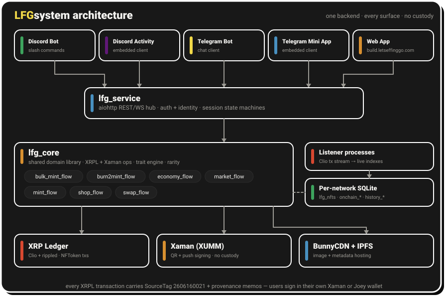
</div>

Four thin client surfaces all talk over REST/WS to one aiohttp backend (`lfg_service`):

- **Discord bot** — the classic in-chat surface, fully refactored onto the shared backend
- **Discord Activity** — the embedded web client
- **Telegram bot** — which can alternatively serve the same client as a Mini App
- **Web app** — the same no-build client, served by GitHub Pages at [build.letseffinggo.com](https://build.letseffinggo.com)

`lfg_service` runs the mint / swap / market / economy session state machines, submits every XRPL transaction, and builds every Xaman signing payload. Shared domain logic lives in `lfg_core`; a **separate listener process group** streams the Clio transaction feed into the per-network SQLite index and ledger-history stores that the backend reads. **No private keys ever touch the app** — all signing happens in the user's Xaman wallet, images and metadata are hosted on BunnyCDN, and the NFT schema is pinned on IPFS.

A fifth path in — not a client surface — is the **X funnel**: `lfg_service` also serves per-NFT share-card pages whose Twitter/OG tags render a branded card on X and whose body forwards humans into the web app, which, as an installable PWA, mints happily from X's in-app browser. The brand-account auto-poster (`run_x.py`) is built and flag-gated behind `X_ENABLED`.

<div align="center">
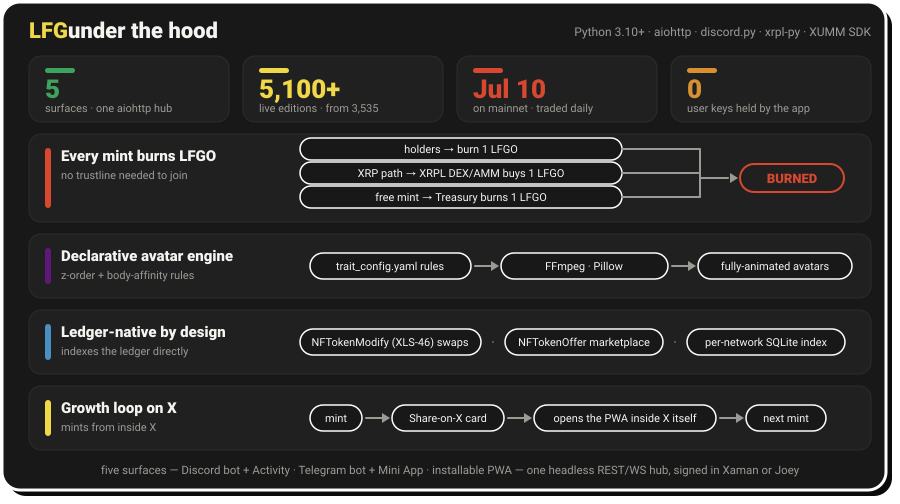
</div>
<details>
<summary><b>Repository layout</b></summary>

```
LFG/
├── main.py                 # Classic Discord bot launch shim
├── run_telegram.py         # Telegram surface launch shim
├── run_x.py                # X auto-poster launch shim (flag-gated, X_ENABLED)
├── lfg_service/            # Shared REST/WS backend (aiohttp) — the hub
│   └── app.py              # API, Activity static host, session state machines
├── lfg_core/               # Shared domain library (used by every process)
│   ├── config.py           # All environment configuration
│   ├── xrpl_ops.py         # Mint, burn, offers, payment watching
│   ├── xumm_ops.py         # Xaman payload builders + SourceTag/Memos
│   ├── mint_flow.py        # Mint session state machine
│   ├── swap_flow.py        # Trait-swap state machine
│   ├── market_flow.py      # Marketplace list/buy/cancel state machines
│   ├── economy_flow.py     # Dress-up economy flows
│   ├── shop_flow.py        # Trait Shop — BRIX-priced on-demand trait mint
│   ├── bulk_mint_flow.py   # Bulk mint — pay once, mint N editions
│   ├── burn2mint_flow.py   # Burn-to-mint — burn M own NFTs for M fresh mints (#220)
│   ├── layer_store.py      # Trait layer store (local-first)
│   └── traits.py           # Rules-driven trait selection
├── surfaces/
│   ├── discord_bot/        # Discord bot (bot.py, commands, views, admin)
│   ├── telegram_bot/       # Telegram bot + Mini App
│   ├── x_bot/              # X (Twitter) brand-account auto-poster
│   └── _client/, _shared/  # Surface SDK (LFGServiceClient) + plumbing
├── webapp/
│   ├── server.py           # Launch shim → lfg_service.app
│   └── client/             # No-build frontend (vanilla JS) — Activity + the live web app
├── scripts/                # Ops: onchain_listener, backfills, audits, economy CLIs
├── trait_config.yaml       # Declarative trait rules (z-order, affinity, swap matrix)
└── docs/                   # ACTIVITY_SETUP.md, HACKATHON.md, ops/ runbooks, superpowers/ specs+plans
```

</details>

<details>
<summary><b>Deployment</b></summary>

Production runs as two branch-driven [pm2](https://pm2.keymetrics.io/) stacks on one host:
**`main` → staging** (testnet) and **`deploy` → prod** (mainnet). Each stack runs the
bot, the Activity backend, the Telegram surface, a clio index/history listener, a nightly
balance-snapshot cron, and a polling **deployer** that fast-forwards its checkout when its
branch moves, reinstalls on dependency changes, and drain-restarts the processes. Merging to
`main` auto-deploys staging only; promoting to prod is an explicit fast-forward
(`scripts/promote.sh`). Ecosystem files: `ecosystem.prod.config.js` / `ecosystem.staging.config.js`.

The standalone web app is the same `webapp/client/` bundle, published to GitHub Pages
at [build.letseffinggo.com](https://build.letseffinggo.com) by `.github/workflows/pages.yml`
on every push to `deploy`; the prod API answers it cross-origin, gated by the
`WEB_ALLOWED_ORIGINS` allowlist.

</details>

---

## Quick start

**Prerequisites:** Python 3.10+, `ffmpeg` on the system path (`apt-get install ffmpeg` / `brew install ffmpeg`), a Discord application (bot token + Client ID/Secret), [Xaman API credentials](https://apps.xumm.dev/), a BunnyCDN storage zone, and a funded XRPL account ([testnet faucet](https://xrpl.org/xrp-testnet-faucet.html) for testing). To just run the test suite, Python + ffmpeg are enough.

> ⚠️ **Set `XRPL_NETWORK=testnet` before your first run — the default is mainnet.**

```bash
git clone https://github.com/Team-Hamsa/LFG.git
cd LFG
./setup.sh            # builds .venv, installs deps, installs the pre-push hook
source .venv/bin/activate
```

Then create a `.env` in the repo root (variable reference in the collapsed section below) and run a surface — start with `lfg_service`, the hub every other surface talks to:

```bash
# The shared backend + Discord Activity host (run this first — port 8176)
python -m lfg_service.app

# Classic Discord bot
python main.py

# Telegram bot
python run_telegram.py

# Tests
python3 -m pytest
```

<details>
<summary><b>Environment variables</b></summary>

Minimum to mint from the classic bot:

```plaintext
DISCORD_BOT_TOKEN=...        # classic bot only
XUMM_API_KEY=...
XUMM_API_SECRET=...
SEED=...                     # XRPL wallet seed used for minting/backend signing
TOKEN_ISSUER_ADDRESS=...
TOKEN_CURRENCY_HEX=...
BUNNY_CDN_ACCESS_KEY=...
BUNNY_CDN_STORAGE_ZONE=...
```

The Discord Activity additionally needs:

```plaintext
DISCORD_CLIENT_ID=...
DISCORD_CLIENT_SECRET=...
WEBAPP_SESSION_SECRET=...
WEBAPP_PORT=8176
```

Optional surfaces / features: `TELEGRAM_BOT_TOKEN`, `SERVICE_TOKEN_TELEGRAM`,
`TELEGRAM_MINI_APP_URL` (Mini App), `MARKET_ENABLED` (character marketplace, `1`
by default), `ECONOMY_ENABLED` (trait economy + Trait Shop; default `0`, set to
`1` in production), `BULK_MINT_UI_ENABLED` (Activity bulk-mint stepper, default `0`),
`MAX_COLLECTION_SIZE` / `BULK_MINT_MAX` (bulk-mint caps), `SHOP_BASE_BRIX` /
`SHOP_MIN_BRIX` / `SHOP_MAX_BRIX` (Trait Shop pricing), `WEB_ALLOWED_ORIGINS`
(standalone web app CORS allowlist; empty = off), `PUBLIC_SHARE_BASE_URL` /
`SHARE_FORWARD_URL` / `SHARE_CARD_RENDER_ENABLED` (Share-on-X card pages +
forwarding), `X_ENABLED` + `X_*` OAuth creds (brand-account auto-poster),
`XRPL_NETWORK`, `XRPL_CLIO_WS_URL`, `BRIX_DISTRIBUTOR_ADDRESS`,
`BRIX_AMM_ACCOUNT`.

The full list with defaults lives in `lfg_core/config.py`. **Defaults target
mainnet** (`XRPL_NETWORK=mainnet`, `s1.ripple.com`); set `XRPL_NETWORK=testnet`
for testing. Xaman was formerly called XUMM — the API credentials, the developer
console, and `lfg_core/xumm_ops.py` still use the old name. Full Discord Activity
setup is documented in [docs/ACTIVITY_SETUP.md](docs/ACTIVITY_SETUP.md).

</details>

<details>
<summary><b>Trait layers</b></summary>

Trait art is served from the local `layers/` tree (`LAYER_SOURCE=local` — the
production setting; the code default is `cdn`); BunnyCDN is still used for
minted image/metadata uploads.

```
layers/
├── shared/     # universal art every body pulls from (Background, Back)
├── male/  female/  ape/  milady/  skeleton/
│   └── Body/ Clothing/ Mouth/ Eyebrows/ Eyes/ Head/ Accessory/
```

Trait legality — layer order, per-value body affinity, and the cross-body swap
matrix — lives in `trait_config.yaml` at the repo root, validated by
`scripts/validate_trait_config.py` (runs in pre-commit and CI).

</details>

---

## Roadmap

**Remaining** — synced automatically from [`roadmap`-labelled issues](../../issues?q=label%3Aroadmap)

- [ ] **X auto-poster go-live** — code shipped and flag-gated (`X_ENABLED`); what's left is ops (brand-account credentials + pm2 registration)

<!-- roadmap:start -->
- [ ] [#39 — Admin tooling for authoring trait_config.yaml (config-gen UI)](../../issues/39)
- [ ] [#48 — feat: BRIX daily distribution to holders (1/day per unlisted NFT; claim in app)](../../issues/48)
- [ ] [#332 — ops(sponsored-mint): execute the staging rehearsal before any production activation of the SourceTag free mint](../../issues/332)
- [ ] [#354 — Skeleton body cannot wear the pirate outfit ("Swashbuckler") — missing skeleton art](../../issues/354)
- [ ] [#355 — Skeleton body is missing ~247 pieces of trait art (Clothing + Head parity)](../../issues/355)

**Recently completed** (moved here automatically when a roadmap issue closes)

- [x] [#252 — feat(x): per-user OAuth2 PKCE — share from my account (phase 3 of #41)](../../issues/252) (closed 2026-08-18)
- [x] [#207 — feat: User profiles (first-class profile above per-platform identities)](../../issues/207) (closed 2026-08-18)
- [x] [#273 — Share-link mint attribution: record stashed ref on mint, conversion metrics](../../issues/273) (closed 2026-08-18)
- [x] [#334 — refactor(sponsored-mint): readiness audit hardcodes two operator wallet addresses as a pass requirement](../../issues/334) (closed 2026-08-16)
- [x] [#336 — test(mint): the sponsored prepared-mint resume path has zero coverage — pin it, then consider extracting the duplicated post-mint tail](../../issues/336) (closed 2026-08-16)
- [x] [#335 — refactor(sponsored-mint): remove unreachable helpers in sponsored_mint.py and fix the archive-scan canary test](../../issues/335) (closed 2026-08-16)
<!-- roadmap:end -->

<details>
<summary><b>Completed</b></summary>

- [x] [#26 — Testnet BRIX/XRP AMM pool](../../issues/26)
- [x] [#27 — QR callback routing for mobile (UA-aware deep-link)](../../issues/27)
- [x] [#28 — Generation rules and exclusions (body-affinity matrix from mint history)](../../issues/28)
- [x] [#29 — NFT rarity logic (tiers, weights, metadata scoring)](../../issues/29)
- [x] [#30 — Cross-body-type trait swapping rules](../../issues/30)
- [x] [#38 — Ape bodies incorrectly assigned face traits](../../issues/38)
- [x] [#40 — Trait selection rules engine (`trait_config.yaml`)](../../issues/40)
- [x] [#43 — Telegram integration](../../issues/43)
- [x] [#44 — In-app marketplace (list, browse, buy via Xaman)](../../issues/44)
- [x] [#46 — Dress-up game](../../issues/46) — live on mainnet since 2026-07-21 ([#185](../../issues/185))
- [x] [#42 — Web UI](../../issues/42) — shipped live via [#240](../../issues/240); profile pages continue in [#207](../../issues/207)
- [x] [#45 — DEX integration backend (OfferCreate/Cancel, order book)](../../issues/45)
- [x] [#47 — AMM integration backend](../../issues/47) — incl. the live XRP→BRIX on-ramp (PR [#248](../../pull/248))
- [x] [#49 — XRPL AI-agent integration exploration](../../issues/49) — closed as a decision: custody deferred
- [x] [#215 — Bulk minting (pay once, mint N editions in one durable batch job)](../../issues/215)
- [x] [#217 — Trait Shop (BRIX-priced on-demand trait minting)](../../issues/217) — live on mainnet with the [#185](../../issues/185) economy flip
- [x] [#240 — Standalone web surface — the Activity live in any browser at build.letseffinggo.com](../../issues/240)
- [x] [#41 — X (Twitter) integration](../../issues/41) — auto-post on mint (PR [#245](../../pull/245)), admin runtime toggle ([#255](../../pull/255)), Share-on-X buttons + per-NFT card pages ([#258](../../pull/258)), click-through forwarding + share attribution ([#274](../../pull/274)); auto-poster go-live tracked above
- [x] PWA install + social share card — manifest, favicons, homescreen icons (PR [#246](../../pull/246))
- [x] BRIX-denominated trait listings + XRP→BRIX AMM on-ramp (PR [#248](../../pull/248), shared payment-path helper [#238](../../issues/238))
- [x] Bulk-mint Activity UI behind `BULK_MINT_UI_ENABLED` (PR [#272](../../pull/272))
- [x] Atomic collection-cap headroom reservation — concurrent mints can never overshoot the cap (PR [#267](../../pull/267))
- [x] Animated MP4 NFTs play as video in the Activity + Telegram (PRs [#251](../../pull/251), [#249](../../pull/249))
- [x] Shared-services spine — one backend + Surface SDK ([#43](../../issues/43)/[#53](../../issues/53); PRs [#76](../../pull/76), [#78](../../pull/78), [#79](../../pull/79), [#80](../../pull/80), [#81](../../pull/81), [#82](../../pull/82))
- [x] Milady body + animated trait layers (PRs [#171](../../pull/171), [#174](../../pull/174))
- [x] Network-aware app database — testnet mints no longer poison the mainnet counter (PR [#167](../../pull/167))
- [x] Mainnet cutover — 3,535 live editions, zero drift (2026-07-10)

</details>

---

## License

LFG is released under the **MIT License** — see [LICENSE](LICENSE).

---

<div align="center">

**[Live app](https://build.letseffinggo.com)** · **[Build log](docs/HACKATHON.md)** · **[Activity setup](docs/ACTIVITY_SETUP.md)** · **[Contributing](CONTRIBUTING.md)** · **[License](#license)**

</div>

**Acknowledgments** — [xrpl-py](https://github.com/XRPLF/xrpl-py), the [Xaman (XUMM) SDK](https://github.com/XRPL-Labs/XUMM-SDK), the [Discord Embedded App SDK](https://github.com/discord/embedded-app-sdk), [BunnyCDN](https://bunny.net/), and [FFmpeg](https://ffmpeg.org/).

*XRPL Make Waves Hackathon entry.*
